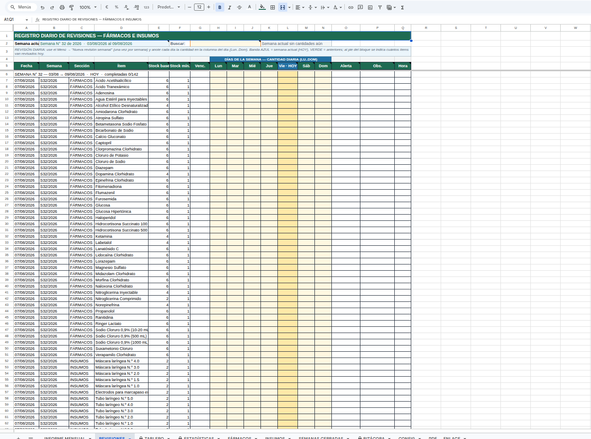
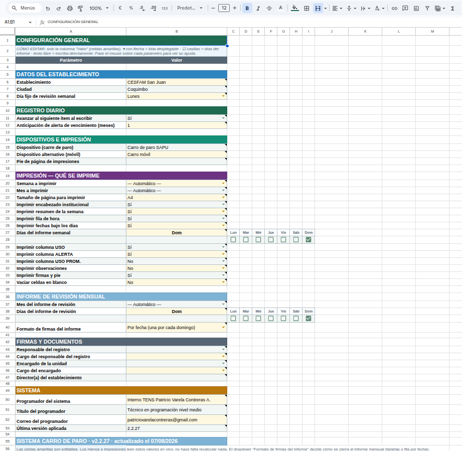
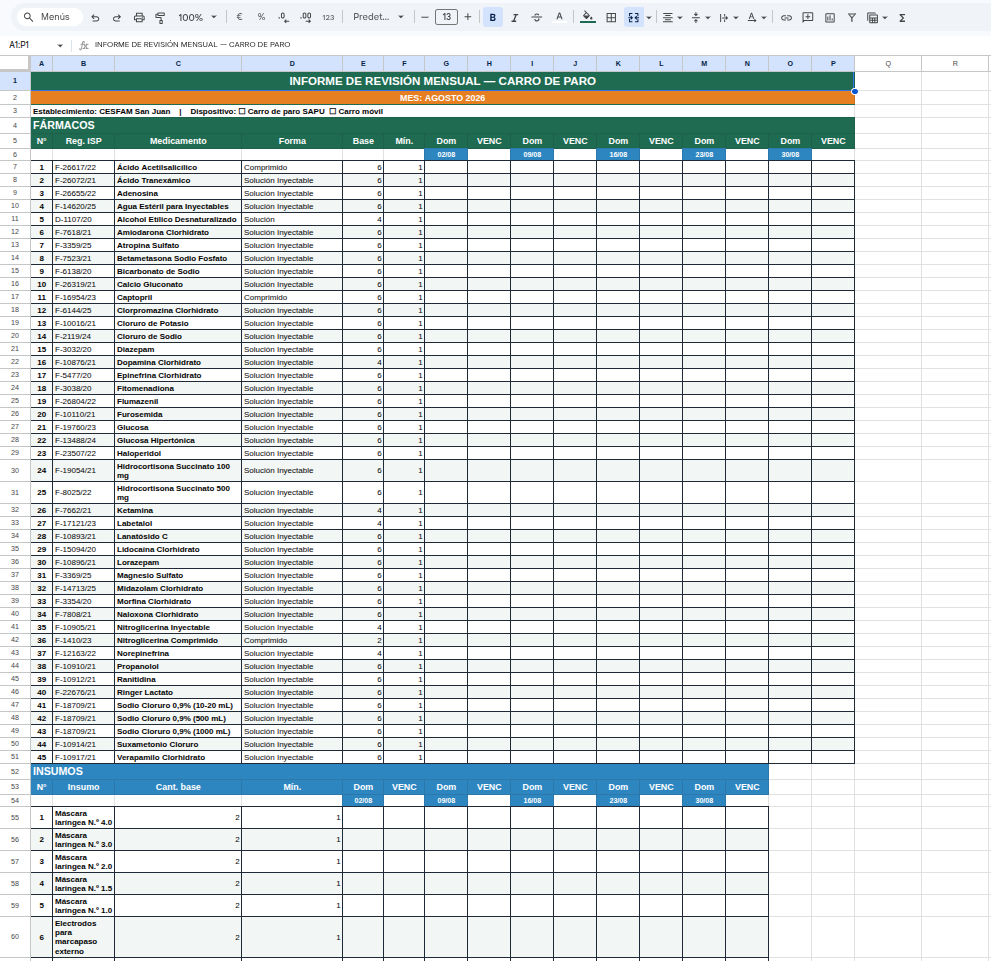
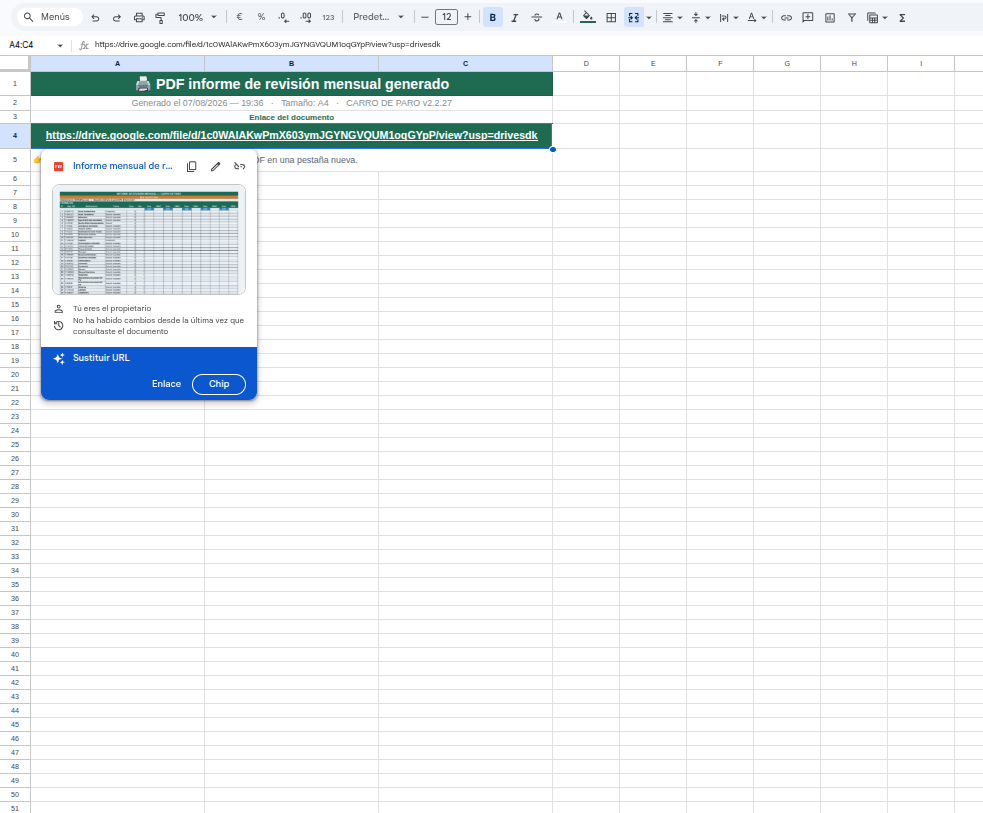

# Proyecto Carro de Paro - CESFAM San Juan

[](LICENSE)   [](https://github.com/2674321/carro-de-paro/actions/workflows/ci.yml)


Sistema de gestión y revisión de inventario para los carros de paro del **SAPU** (Servicio de Atención Móvil de Urgencia) del CESFAM San Juan.

## Descripción

Aplicación web desarrollada en Google Apps Script para la gestión del carro de paro, incluyendo:

- Control de inventario de medicamentos y insumos
- Registro de atenciones y procedimientos
- Generación de reportes y estadísticas
- Control de stock y vencimientos

## Tecnologías

- **Backend:** Google Apps Script
- **Frontend:** HTML5 / CSS3 / JavaScript
- **Base de datos:** Google Sheets
- **API:** Google Apps Script Web App

## Capturas

> Datos ficticios · capturas: agosto 2026 · SISTEMA V2


*Hoja de revisiones · ago 2026 · v2*


*Hoja de configuraciones · ago 2026 · v2*


*Informe mensual · ago 2026 · v2*


*Informe PDF generado · ago 2026 · v2*
## Estructura del Proyecto

```
Proyecto carro de paro - Cesfam S. J./
├── SISTEMA V2/              # Versión 2 del sistema
│   ├── 00_Sistema.gs        # Configuración general
│   ├── 01_Menu.gs           # Menú principal
│   ├── 02_Utilidades.gs     # Funciones auxiliares
│   ├── 03_Maestros.gs       # Gestión de datos maestros
│   ├── 04_Revisiones.gs     # Funciones de revisión
│   ├── 05_Busqueda.gs       # Búsqueda de registros
│   ├── 06_Impresion.gs      # Generación de documentos
│   ├── 07_PDF.gs            # Generación de PDFs
│   ├── 08_Selectores.gs     # Selectores de UI
│   ├── 09_Config.gs         # Configuración del sistema
│   ├── 10_Tablero.gs        # Dashboard/Tablero
│   ├── 11_Estadisticas.gs   # Estadísticas y reportes
│   ├── 12_Bitacora.gs       # Registro de actividad
│   ├── 13_Personalizacion.gs # Personalización
│   ├── appsscript.json      # Manifest de Apps Script
│   └── README_instalacion.md # Guía de instalación
```

## Instalación

Consultar `SISTEMA V2/README_instalacion.md` para instrucciones detalladas de instalación y configuración.

## Licencia

MIT — ver [LICENSE](LICENSE).
